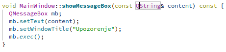

# Izveštaj analize projekta

## Tehnički uvod

Projekat <b>Slagalica</b> sastoji se od 4 podprojekta:
 * <b>serialization</b> - biblioteka za JSON serijalizaciju i deserijalizaciju
 * <b>server</b> - serverska aplikacija zadužena za očitavanje kombinacija pitanja iz skupa mogućih kombinacija i bodovanje takmičara
 * <b>slagalica</b> - klijentska GUI aplikacija, uspostavlja TCP konekciju sa serverom
 * <b>tests</b> - testovi jedinice koda implementirani u Catch2 biblioteci (Catch 2.13.7 verzija) 

Alat <b>qmake</b> pomaže da se pojednostavi proces izgradnje koda projekata na različitim platformama. Ovaj alat automatizuje generisanje Makefile-a tako da je potrebno samo nekoliko redova informacija za kreiranje svakog Makefile-a. Može se koristiti za bilo koji softverski projekat, bilo da koristi Qt razvojni okvir ili ne. Qmake generiše Makefile na osnovu informacija u <b>.pro</b> datoteci projekta. Ove datoteke kreira programer i obično su jednostavne i lako razumljive, ali za složene projekte mogu se kreirati kompleksniji projektni fajlovi.
U projektnom fajlu analiziranog projekta specifikovano je da je šablon (eng. *template*) <b>subdirs</b>. Osnovna ideja ovog tipa šablona je da navede sve podprojekte koji pripadaju nekoj vrsti meta projekta. Datoteka kreirana za meta projekat (**game.pro**) sastoji se samo od qmake sistemske promenljive SUBDIRS kojoj se dodeljuju relativne putanje do direktorijuma gde se nalazi .pro datoteka svakog od podprojekata (**serialization.pro**, **server.pro**, **slagalica.pro**, **tests.pro**). Uz projekat dostupna je detaljna UML specifikacija koja može biti korisna za bolje razumevanje unutrašnje strukture koda. 

* Pritiskom na *Build* opciju u donjem levom uglu ekrana dolazi do problema zbog redosleda izgradnje podprojekata i njihovih međuzavisnosti:


* Izvršni fajlovi zahtevaju biblioteku za serijalizaciju stoga ona mora biti prva prevedena. Na qmake sistemsku promenljivu CONFIG dodajemo opciju da se podprojekti *build*-uju u navedenom redosledu.
Treba imati na umu da se ovakvo rešenje smatra prevaziđenim i nije primenjivo za složenije modele zavisnosti.


* Nakon ove izmene u **game.pro** datoteci projekat se prevodi. Sada možemo pokrenuti server i dva klijenta i započeti kviz.


* Takođe, možemo pokrenuti testove i uveriti se da svi napisani *unit* testovi prolaze. Više reči o testovima biće u narednom odeljku.


Skripta za prevođenje projekta i pokretanje jedne partije (server i dva klijenta): [start_game.sh](https://github.com/MATF-Software-Verification/2023_Analysis_04-slagalica/blob/main/qmake/skripte/start_game.sh) \
Skripta za prevođenje projekta i pokretanje testova: [start_testing.sh](https://github.com/MATF-Software-Verification/2023_Analysis_04-slagalica/blob/main/qmake/skripte/start_testing.sh)

## Analiza pokrivenosti pomoću Gcov
Pokrivenost koda (eng. *code coverage*) je metrika koja određuje apsolutni ili relativni broj linija, grana ili putanja koje su uspešno proverene našim procesom testiranja. \
**Gcov** je alat, dostupan uz gcc kompilator, koji služi za određivanje pokrivenosti koda prilikom izvršavanja programa. Koristi se da bi se analizirao program i utvrdilo kako se može kreirati efikasniji program i da bi se uvrtdilo koliko je koji deo koda pokrivenim testovima. Zarad lepše reprezentacije rezultata detekcije pokrivenosti koda izvršavanjem test primera, koristimo ekstenziju **Lcov**. \
Kao što je prethodno rečeno, uz analizirani projekat su dostupni testovi jedinice koda implementirani pomoću Catch2 biblioteke. U ovom odeljku ispitaćemo pokrivenost koda testovima pomoću **Gcov** i **Lcov** alata.   

 * Na početku u .pro datoteku test projekta dodajemo sledeću naredbu:  
```
CONFIG += gcov 
```
* Qt okruženje na osnovu ovoga dodaje --coverage opciju g++-u u *Makefile*-u
* Dodatne opcije kompilatora omogućavaju snimanje koliko je puta koja linija, grana i funkcija izvršena. Nakon *Build*-a projekta primećujemo da su u build direktorijumu test projekta osim objektnih  dodati i fajlovi sa ekstenzijom **.gcno** za svaku *source* datoteku. Upravo oni imaju tu namenu.


* Nakon pokretanja testova možemo primetiti da se sada u build direktorijumu test projekta nalaze i fajlovi sa ekstenzijom **.gcda** za svaku *source* datoteku. U njima se nalaze informacije o pokrivenosti prikupljene tokom izvršavanja testova.
   


* Informacije iz ovih fajlova ne tumačimo direktno. Koristimo alat **Lcov** koji ih može analizirati i za nas napraviti izveštaj sa ekstenzijom **.info**. Demonstracije radi zahtevaćemo u izveštaju i informacije o pokrivenosti grana. Pozicioniramo se u build direktorijum test projekta i pokrenemo sledeću komandu:
```
lcov --rc lcov_branch_coverage=1 --capture --directory . -o coverage.info
```
* Naš izveštaj **coverage.info** možemo dati kao alatu **genhtml** koji će od njega napraviti **.html** stranice lake za pregled i analizu:
```
genhtml --rc lcov_branch_coverage=1 -o Reports coverage.info
```
* Nakon izvršenja prethodne komandu u terminalu možemo videti zbirne statistike procentualne pokrivenosti linija, funkcija i grana. Naravno, u **Reports** direktorijumu se sada nalazi detaljan html izveštaj koji možemo otvoriti u *browser*-u:
```
firefox Reports/index.html
```


* Očekujemo visok nivo pokrivenosti linija i funkcija u **tests** projektu iako u izveštaju izgleda drugačije. Ako pogledamo .html stranicu posvećenu ovom projektu možemo se uveriti da se implementirani *unit* testovi zaista izvršavaju ali da je uzrok niske pokrivenosti to što je analizirana i pokrivenost *header-only* Catch2 biblioteke. 


 
* I u ostatku izveštaja možemo videti gomilu informacija o pokrivenosti biblioteka jezika, Qt-a itd. Ove informacije čine izveštaj nepotrebno velikim i zamagljuju nam pokrivenost funkcionalnosti koje testiramo. U našem slučaju testiraju se podprojekti **server** i **slagalica** i samo nas njihove pokrivenosti zanimaju. Narednom komandom možemo filtrirati izveštaj od informacija o datotekama koje nisu od interesa:
```
lcov -r --rc lcov_branch_coverage=1 "coverage.info" "*Qt*.framework*" "*.h" "*/tests/*" "*Xcode.app*" "*.moc" "*moc_*.cpp"  "/usr/*" "/opt/*"  "*/test/*" "*/build*/*" -o "coverage-filtered.info"
```
* Filtrirani **coverage-filtered.info** sada možemo vizuelizovati na isti način:
```
genhtml --rc lcov_branch_coverage=1 -o Reports_filtered coverage-filtered.info
firefox Reports_filtered/index.html
```
* Pokrivenost projekata **server** i **slagalica**:


* Pokrivenost **server**-a po klasama:


* Pokrivenost **slagalica**-e po klasama:


* Pokrivenost klase **koznazna.cpp** (možemo videti i koliko puta se izvršila svaka linija, funkcija, grana):


* Na osnovu izveštaja jasno se vidi da je pokrivenost koda testovima nedovoljna i da je potrebno napisati dodatne testove.
* Pregledom koda utvrđeno je da je kod u velikom procentu modularan i funkcije imaju jedinstveno zaduženje pa se može smatrati testabilnim. Testovi su napisani na sistematičan način prateći *Arrange-Act-Assert* paradigmu i intuitivno nazvani.
* Iz navedenih razloga postojeći skup testova je proširiv.

Generisani rezultati mogu se videti [ovde](https://github.com/MATF-Software-Verification/2023_Analysis_04-slagalica/tree/main/Gcov/rezultati). \
Skripta čijim izvršavanjem se mogu reprodukovati rezultati analize pokrivenosti (argumentom komandne linije odabira se da nefiltriran ili filtriran izveštaj): [coverage.sh](https://github.com/MATF-Software-Verification/2023_Analysis_04-slagalica/blob/main/Gcov/skripte/coverage.sh)

## Clang alati
**Clang** je kompilator za jezike C, C++, Objective C... Tačnije, **Clang** je frontend koji kao ulaz uzima kod napisan u prethodno navedem jezicima i prevodi ga u međureprezenaticiju tj *llvm IR* i to predstavlja ulaz za središnji deo na kojem se vrše optimizacije nezavisne od jezika i arhitekture. Na kraju backend vrši optimizacije vezane za konkretnu arhitekturu i prevodi kod na mašinski jezik. U odnosu na gcc, implementiran je u C++-u korišćenjem modernijih tehnologija. Detaljnije predstavlja informacije u slučaju greške ili upozorenja, a uglavnom daje više upozorenja u odnosu na gcc. Način upotrebe je veoma sličan.

### Clang-Tidy
**Clang-Tidy** deo je Clang/LLVM projekta i predstavlja C++ **linter** alat. Njegova svrha je da obezbedi proširivi okvir za dijagnostikovanje i ispravljanje tipičnih grešaka u programiranju, poput kršenja stila, neispravne upotrebe interfejsa ili bagova koji se mogu otkriti **statičkom analizom**. **Clang-Tidy** je modularan i pruža zgodan interfejs za pisanje novih provera. 

Ovaj alat je integrisan u QtCreator. Prikazaćemo način upotrebe i dobijene rezultate za naš projekat.

* Odabiramo karticu **Analyze** i nakon toga **Clang-Tidy** iz padajućeg menija.
  


* Selektujemo fajlove nad kojima želimo da primenimo analizu (u našem slučaju svi **.hpp** i **.cpp** fajlovi u projektu).


* Nakon pokretanja dobijamo 5 upozorenja. U nastavku ćemo ih ukratko analizirati i pokušati da ih otklonimo.


* Prvo upozorenje odnosi se na **mrtav kod** u funkciji koja generiše pseudoslučajnu kombinaciju od 4 karaktera za igru Skočko. Vidimo da se na početku f-je u petlji 50 puta generišu pseudoslučajne vrednosti i smeštaju u promenljivu **rnd** a potom nigde ne koriste. Ovaj deo koda možemo obrisati.


* Drugo upozorenje odnosi se na potencijalno **dereferenciranje null pokazivača**. Prijavljeno je u funkciji koja u igri Spojnice treba da onesposobi jedno od 8 dugmića (ono koje odgovara uspešno povezanom pojmu). Prosleđeni argument **btnIndex** očekujemo da ima vrednost iz intervala od 0 do 7, u suprotnom će **btn** pokazivač u trenutku derefenciranja biti null. Želimo da naša funkcija bude napisana na bezbedan način.


* U C++-u ne postoji *NullPointerException* koji bismo mogli da uhvatimo u try-catch bloku. Derefernciranje null pokazivača u C++-u izaziva nedefinisano ponašanje. U ovoj funkciji rešićemo se upozorenja tako što ćemo ispaliti **invalid_argument** izuzetak ako prosleđeni argument nije u očekivanom intervalu. Sada pozive ove funkcije treba staviti u try-catch blok i obraditi izuzetak.


* Naredna dva upozorenja odnose se na **curenje memorije**. Sve što treba uraditi je pozvati **destruktor** koji će obrisati dinamički kreiran objekat dealociranjem njemu dodeljene memorije. 


* Poslednje upozerenje se takođe odnosi na **curenje memorije**. U ovom slučaju zaključujemo da se radi o **false positive** upozorenju jer je destruktor pozvan na drugom mestu.


* Prethodna analiza sprovedena je sa osnovnom konfiguracijom. Sada ćemo napraviti našu *custom* konfiguraciju.

* Odabiramo opciju **Edit** i nakon toga **Preferences** iz padajućeg menija i potom **Analyzer** iz liste sa leve strane.


* Pritiskamo na **Default Clang-Tidy and Clazy checks** nudi nam se izbor konfiguracija i opcija da napravimo novu. Jedine podrazumevano uključene jesu <b>clang-\*</b> provere, u novu konfiguraciju dodajemo i <b>modernize-\*</b>, <b>readability-\*</b>, <b>performance-\*</b> i <b>llvm-\*</b> provere.   


* Odabiramo novu konfiguraciju i pokrećemo analizu.


* Dobijamo veliki broj upozorenja. U nastavku navešćemo opšti pregled i nekoliko primera. Napominjemo da alat takođe nudi i **fixits** - predloge rešenja pojedinih nađenih problema. Da bismo primenili predlog dovoljno je da se pozicioniramo na odgovarajuće mesto u kodu i pritisnemo **Alt+Enter**.


* **Modernize** provere nam na nekoliko mesta predlažu upotrebu ključnih reči **auto** i **override**, **trailing-return-type**... Primećujemo da su ove funkcionalnosti dodate u **C++11** standardu. Na nekoliko mesta nam savetuje da dodamo **[[nodiscard]]** atribut na deklaraciju funkcija. Ovaj atribut dodat je u **C++17** standardu i predstavlja *hint* prevodiocu (ali i programerima) da se povratna vrednost f-je ne sme zanemariti. Navedene sugestije treba pažljivo primenjivati jer u nekim slučajevima mogu da smanje čitljivost (npr. prečesto korišćenje ključne reci **auto**).
* Još jedan primer odnosi se na definisanje podrazumevanog konstruktora:
```
JSONSerializer::JSONSerializer() {
}
```
* Ovaj kod možemo zameniti narednim:
```
JSONSerializer::JSONSerializer()=default;
```

* **Readability** upozorenja se u velikom procentu odnose na upotrebu magičnih konstanti, kratka imena promenljivih (predložena najmanja dužina je 3), a na nekoliko mesta postoji nekonzistentost u imenovanju argumenata f-ja (različita imena argumenata u deklaraciji u .hpp fajlu i u definiciji u .cpp fajlu).

* **Performance** provere nam na nekoliko mesta predlažu da koristimo **'\n'** umesto **std::endl**. Jedina razlika je u tome što **std::endl** izaziva pražnjenje izlaznog bafera i ispis na izlaz odmah što može negativno uticati na performanse.
* Još jedan slučaj jeste prenošenje argumenta po vrednosti umesto po referenci zbog čega dolazi do nepotrebnog kopiranja. Na primer:

  

* Argument **content** se ne menja u f-ji **showMessageBox** i može se proslediti kao const referenca.

  
  
* **LLVM** provere se nisu pokazale kao posebno korisne u ovom slučaju. Upozorenja se odnose na redosled *include* direktiva i stil *header guard*-ova. Pored ovoga na jednom mestu nam sugeriše da je standard da se nakon kraja okvira za namespace doda komentar na koji se namespace taj kraj odnosi.

### Clazy


