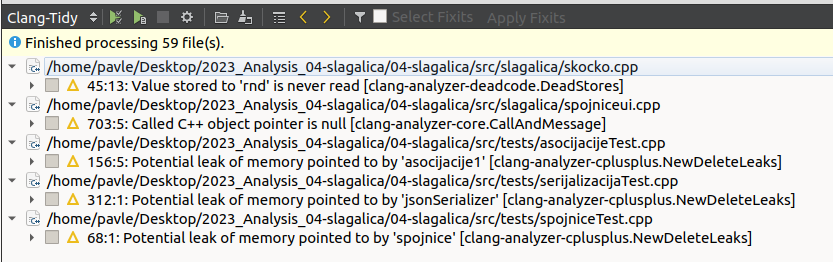

# Izveštaj analize projekta

## Tehnički uvod

Projekat <b>Slagalica</b> sastoji se od 4 podprojekta:
 * <b>serialization</b> - biblioteka za JSON serijalizaciju i deserijalizaciju
 * <b>server</b> - serverska aplikacija zadužena za očitavanje kombinacija pitanja iz skupa mogućih kombinacija i bodovanje takmičara
 * <b>slagalica</b> - klijentska GUI aplikacija, uspostavlja TCP konekciju sa serverom
 * <b>tests</b> - testovi jedinice koda implementirani u Catch2 biblioteci (Catch 2.13.7 verzija) 

Alat <b>qmake</b> pomaže da se pojednostavi proces izgradnje koda projekata na različitim platformama. Ovaj alat automatizuje generisanje Makefile-a tako da je potrebno samo nekoliko redova informacija za kreiranje svakog Makefile-a. Može se koristiti za bilo koji softverski projekat, bilo da koristi Qt razvojni okvir ili ne. Qmake generiše Makefile na osnovu informacija u <b>.pro</b> datoteci projekta. Ove datoteke kreira programer i obično su jednostavne i lako razumljive, ali za složene projekte mogu se kreirati kompleksniji projektni fajlovi.
U projektnom fajlu analiziranog projekta specifikovano je da je šablon (eng. *template*) <b>subdirs</b>. Osnovna ideja ovog tipa šablona je da navede sve podprojekte koji pripadaju nekoj vrsti meta projekta. Datoteka kreirana za meta projekat (**game.pro**) sastoji se samo od qmake sistemske promenljive SUBDIRS kojoj se dodeljuju relativne putanje do direktorijuma gde se nalazi .pro datoteka svakog od podprojekata (**serialization.pro**, **server.pro**, **slagalica.pro**, **tests.pro**). Uz projekat dostupna je detaljna UML specifikacija koja može biti korisna za bolje razumevanje unutrašnje strukture koda. 

* Pritiskom na *Build* opciju u donjem levom uglu ekrana dolazi do problema zbog redosleda izgradnje podprojekata i njihovih međuzavisnosti:


* Izvršni fajlovi zahtevaju biblioteku za serijalizaciju stoga ona mora biti prva prevedena. Na qmake sistemsku promenljivu CONFIG dodajemo opciju da se podprojekti *build*-uju u navedenom redosledu.
Treba imati na umu da se ovakvo rešenje smatra prevaziđenim i nije primenjivo za složenije modele zavisnosti.


* Nakon ove izmene u **game.pro** datoteci projekat se prevodi. Sada možemo pokrenuti server i dva klijenta i započeti kviz.


* Takođe, možemo pokrenuti testove i uveriti se da svi napisani *unit* testovi prolaze. Više reči o testovima biće u narednom odeljku.


Skripta za prevođenje projekta i pokretanje jedne partije (server i dva klijenta): [start_game.sh](https://github.com/MATF-Software-Verification/2023_Analysis_04-slagalica/blob/main/qmake/skripte/start_game.sh) \
Skripta za prevođenje projekta i pokretanje testova: [start_testing.sh](https://github.com/MATF-Software-Verification/2023_Analysis_04-slagalica/blob/main/qmake/skripte/start_testing.sh)

## Analiza pokrivenosti pomoću Gcov

Pokrivenost koda (eng. *code coverage*) je metrika koja određuje apsolutni ili relativni broj linija, grana ili putanja koje su uspešno proverene našim procesom testiranja. \
**Gcov** je alat, dostupan uz gcc kompilator, koji služi za određivanje pokrivenosti koda prilikom izvršavanja programa. Koristi se da bi se analizirao program i utvrdilo kako se može kreirati efikasniji program i da bi se uvrtdilo koliko je koji deo koda pokrivenim testovima. Zarad lepše reprezentacije rezultata detekcije pokrivenosti koda izvršavanjem test primera, koristimo ekstenziju **Lcov**. \
Kao što je prethodno rečeno, uz analizirani projekat su dostupni testovi jedinice koda implementirani pomoću Catch2 biblioteke. U ovom odeljku ispitaćemo pokrivenost koda testovima pomoću **Gcov** i **Lcov** alata.   

 * Na početku u .pro datoteku test projekta dodajemo sledeću naredbu:  
```
CONFIG += gcov 
```
* Qt okruženje na osnovu ovoga dodaje --coverage opciju g++-u u *Makefile*-u
* Dodatne opcije kompilatora omogućavaju snimanje koliko je puta koja linija, grana i funkcija izvršena. Nakon *Build*-a projekta primećujemo da su u build direktorijumu test projekta osim objektnih  dodati i fajlovi sa ekstenzijom **.gcno** za svaku *source* datoteku. Upravo oni imaju tu namenu.


* Nakon pokretanja testova možemo primetiti da se sada u build direktorijumu test projekta nalaze i fajlovi sa ekstenzijom **.gcda** za svaku *source* datoteku. U njima se nalaze informacije o pokrivenosti prikupljene tokom izvršavanja testova.
   


* Informacije iz ovih fajlova ne tumačimo direktno. Koristimo alat **Lcov** koji ih može analizirati i za nas napraviti izveštaj sa ekstenzijom **.info**. Demonstracije radi zahtevaćemo u izveštaju i informacije o pokrivenosti grana. Pozicioniramo se u build direktorijum test projekta i pokrenemo sledeću komandu:
```
lcov --rc lcov_branch_coverage=1 --capture --directory . -o coverage.info
```
* Naš izveštaj **coverage.info** možemo dati alatu **genhtml** koji će od njega napraviti **.html** stranice lake za pregled i analizu:
```
genhtml --rc lcov_branch_coverage=1 -o Reports coverage.info
```
* Nakon izvršenja prethodne komandu u terminalu možemo videti zbirne statistike procentualne pokrivenosti linija, funkcija i grana. Naravno, u **Reports** direktorijumu se sada nalazi detaljan html izveštaj koji možemo otvoriti u *browser*-u:
```
firefox Reports/index.html
```


* Očekujemo visok nivo pokrivenosti linija i funkcija u **tests** projektu iako u izveštaju izgleda drugačije. Ako pogledamo .html stranicu posvećenu ovom projektu možemo se uveriti da se implementirani *unit* testovi zaista izvršavaju ali da je uzrok niske pokrivenosti to što je analizirana i pokrivenost *header-only* Catch2 biblioteke. 


 
* I u ostatku izveštaja možemo videti gomilu informacija o pokrivenosti biblioteka jezika, Qt-a itd. Ove informacije čine izveštaj nepotrebno velikim i zamagljuju nam pokrivenost funkcionalnosti koje testiramo. U našem slučaju testiraju se podprojekti **server** i **slagalica** i samo nas njihove pokrivenosti zanimaju. Narednom komandom možemo filtrirati izveštaj od informacija o datotekama koje nisu od interesa:
```
lcov -r --rc lcov_branch_coverage=1 "coverage.info" "*Qt*.framework*" "*.h" "*/tests/*" "*Xcode.app*" "*.moc" "*moc_*.cpp"  "/usr/*" "/opt/*"  "*/test/*" "*/build*/*" -o "coverage-filtered.info"
```
* Filtrirani **coverage-filtered.info** sada možemo vizuelizovati na isti način:
```
genhtml --rc lcov_branch_coverage=1 -o Reports_filtered coverage-filtered.info
firefox Reports_filtered/index.html
```
* Pokrivenost projekata **server** i **slagalica**:


* Pokrivenost **server**-a po klasama:


* Pokrivenost **slagalica**-e po klasama:


* Pokrivenost klase **koznazna.cpp** (možemo videti i koliko puta se izvršila svaka linija, funkcija, grana):


* Na osnovu izveštaja jasno se vidi da je pokrivenost koda testovima nedovoljna i da je potrebno napisati dodatne testove.
* Pregledom koda utvrđeno je da je kod u velikom procentu modularan i funkcije imaju jedinstveno zaduženje pa se može smatrati testabilnim. Testovi su napisani na sistematičan način prateći *Arrange-Act-Assert* paradigmu i intuitivno nazvani.
* Iz navedenih razloga postojeći skup testova je proširiv.

Generisani rezultati mogu se videti [ovde](https://github.com/MATF-Software-Verification/2023_Analysis_04-slagalica/tree/main/Gcov/rezultati). \
Skripta čijim izvršavanjem se mogu reprodukovati rezultati analize pokrivenosti (argumentom komandne linije odabira se nefiltriran ili filtriran izveštaj): [coverage.sh](https://github.com/MATF-Software-Verification/2023_Analysis_04-slagalica/blob/main/Gcov/skripte/coverage.sh)

## Clang alati

**Clang** je kompilator za jezike C, C++, Objective C... Tačnije, **Clang** je frontend koji kao ulaz uzima kod napisan u prethodno navedem jezicima i prevodi ga u međureprezenaticiju tj *llvm IR* i to predstavlja ulaz za središnji deo na kojem se vrše optimizacije nezavisne od jezika i arhitekture. Na kraju backend vrši optimizacije vezane za konkretnu arhitekturu i prevodi kod na mašinski jezik. U odnosu na gcc, implementiran je u C++-u korišćenjem modernijih tehnologija. Detaljnije predstavlja informacije u slučaju greške ili upozorenja, a uglavnom daje više upozorenja u odnosu na gcc. Način upotrebe je veoma sličan.

### Clang-Tidy

**Clang-Tidy** deo je Clang/LLVM projekta i predstavlja C++ **linter** alat. Njegova svrha je da obezbedi proširivi okvir za dijagnostikovanje i ispravljanje tipičnih grešaka u programiranju, poput kršenja stila, neispravne upotrebe interfejsa ili bagova koji se mogu otkriti **statičkom analizom**. **Clang-Tidy** je modularan i pruža zgodan interfejs za pisanje novih provera. 

Ovaj alat je integrisan u QtCreator. Prikazaćemo način upotrebe i dobijene rezultate za naš projekat.

* Odabiramo karticu **Analyze** i nakon toga **Clang-Tidy** iz padajućeg menija.
  


* Selektujemo fajlove nad kojima želimo da primenimo analizu (u našem slučaju svi **.hpp** i **.cpp** fajlovi u projektu).


* Nakon pokretanja dobijamo 5 upozorenja. U nastavku ćemo ih ukratko analizirati i pokušati da ih otklonimo.



* Prvo upozorenje odnosi se na **mrtav kod** u funkciji koja generiše pseudoslučajnu kombinaciju od 4 karaktera za igru Skočko. Vidimo da se na početku f-je u petlji 50 puta generišu pseudoslučajne vrednosti i smeštaju u promenljivu **rnd** a potom nigde ne koriste. Ovaj deo koda možemo obrisati.


* Drugo upozorenje odnosi se na potencijalno **dereferenciranje null pokazivača**. Prijavljeno je u funkciji koja u igri Spojnice treba da onesposobi jedno od 8 dugmića (ono koje odgovara uspešno povezanom pojmu). Prosleđeni argument **btnIndex** očekujemo da ima vrednost iz intervala od 0 do 7, u suprotnom će **btn** pokazivač u trenutku derefenciranja biti null. Želimo da naša funkcija bude napisana na bezbedan način.


* U C++-u ne postoji *NullPointerException* koji bismo mogli da uhvatimo u try-catch bloku. Derefernciranje null pokazivača u C++-u izaziva nedefinisano ponašanje. U ovoj funkciji rešićemo se upozorenja tako što ćemo ispaliti **invalid_argument** izuzetak ako prosleđeni argument nije u očekivanom intervalu. Sada pozive ove funkcije treba staviti u try-catch blok i obraditi izuzetak.


* Naredna dva upozorenja odnose se na **curenje memorije**. Sve što treba uraditi je pozvati **destruktor** koji će obrisati dinamički kreiran objekat dealociranjem njemu dodeljene memorije. 


* Poslednje upozerenje se takođe odnosi na **curenje memorije**. U ovom slučaju zaključujemo da se radi o **false positive** upozorenju jer je destruktor pozvan na drugom mestu.


* Prethodna analiza sprovedena je sa osnovnom konfiguracijom. Sada ćemo napraviti našu *custom* konfiguraciju.

* Odabiramo opciju **Edit** i nakon toga **Preferences** iz padajućeg menija i potom **Analyzer** iz liste sa leve strane.


* Pritiskamo na **Default Clang-Tidy and Clazy checks** nudi nam se izbor konfiguracija i opcija da napravimo novu. Jedine podrazumevano uključene jesu <b>clang-\*</b> provere, u novu konfiguraciju dodajemo i <b>modernize-\*</b>, <b>readability-\*</b>, <b>performance-\*</b> i <b>llvm-\*</b> provere.   


* Odabiramo novu konfiguraciju i pokrećemo analizu.


* Dobijamo veliki broj upozorenja. U nastavku navešćemo opšti pregled i nekoliko primera. Napominjemo da alat takođe nudi i **fixits** - predloge rešenja pojedinih nađenih problema. Da bismo primenili predlog dovoljno je da se pozicioniramo na odgovarajuće mesto u kodu i pritisnemo **Alt+Enter**.


* **Modernize** provere nam na nekoliko mesta predlažu upotrebu ključnih reči **auto** i **override**, **trailing-return-type**... Primećujemo da su ove funkcionalnosti dodate u **C++11** standardu. Na nekoliko mesta nam savetuje da dodamo **[[nodiscard]]** atribut na deklaraciju funkcija. Ovaj atribut dodat je u **C++17** standardu i predstavlja *hint* prevodiocu (ali i programerima) da se povratna vrednost f-je ne sme zanemariti. Navedene sugestije treba pažljivo primenjivati jer u nekim slučajevima mogu da smanje čitljivost (npr. prečesto korišćenje ključne reci **auto**).
* Još jedan primer odnosi se na definisanje podrazumevanog konstruktora:
```
JSONSerializer::JSONSerializer() {
}
```
* Ovaj kod možemo zameniti narednim:
```
JSONSerializer::JSONSerializer()=default;
```

* **Readability** upozorenja se u velikom procentu odnose na upotrebu **magičnih konstanti**, **kratka imena promenljivih** (predložena najmanja dužina je 3), a na nekoliko mesta postoji **nekonzistentost u imenovanju argumenata f-ja** (različita imena argumenata u deklaraciji u .hpp fajlu i u definiciji u .cpp fajlu). Pored ovoga postoji nekoliko slučajeva **pristupa statičkim poljima i funkcijama klasa preko instanci**. 

* **Performance** provere nam na nekoliko mesta predlažu da koristimo **'\n'** umesto **std::endl**. Jedina razlika je u tome što **std::endl** izaziva pražnjenje izlaznog bafera i ispis na izlaz odmah što može negativno uticati na performanse.
* Još jedan slučaj jeste prenošenje argumenta po vrednosti umesto po referenci zbog čega dolazi do **nepotrebnog kopiranja**. Na primer:

  

* Argument **content** se ne menja u f-ji **showMessageBox** i može se proslediti kao const referenca.

  
  
* **LLVM** provere se nisu pokazale kao posebno korisne u ovom slučaju. Upozorenja se odnose na redosled *include* direktiva i stil *header guard*-ova. Pored ovoga na jednom mestu nam sugeriše da je standard da se nakon kraja okvira za namespace doda komentar na koji se namespace taj kraj odnosi.

* **Rezime**: **Clang-Tidy** alat pomogao nam je da otkrijemo propuste vezane za mrtav kod i curenje memorije kojih nije bilo puno ako uzmemo u obzir obim projekta. U projektu se koriste funkcionalnosti novijih standarda jezika ali ne u potpunosti dosledno. Čitljivost bi se mogla poboljšati korišćenjem deskriptivnijih imena promenljivih i izbegavanjem korišćenja magičinih konstanti. Na performansama bi se moglo dobiti izbegavanjem nepotrebnih kopiranja.

### Clazy

**Clazy** je alat za **statičku analizu** i predstavlja dodatak **Clang**-a koji ga proširuje sa preko 50 dijagnostika vezanih za dobre prakse korišćenja Qt biblioteka. Njegov zadatak je da prikazuje upozorenja kompajlera vezana za Qt, kao što su nepravilno korišćenje API-ja, potencijalno curenje memorije, nepravilne konverzije tipova podataka. Kao i **Clang-Tidy** omogućava automatske izmene koda za neka upozorenja (manji broj njih).  

Ovaj alat je integrisan u QtCreator. Prikazaćemo način upotrebe i dobijene rezultate za naš projekat.

* Na isti način kao kod prethodnog alata možemo odabrati provere koje želimo i napraviti našu konfiguraciju. Provere su podeljene na ne nivoe 0, 1 i 2 pri čemu sa povećanjem nivoa raste mogućnost prijavljivanja lažno pozitivnih upozorenja. Pored ovih provera postoji još nekategorisanih provera koje je neophodno manuelno uključiti. S obzirom da želimo što kompletniju analizu u ovom slučaju nećemo menjati podrazumevanu konfiguraciju koja podrazumeva nivoe 0 i 1 za koje imamo garanciju *veoma male* verovatnoće lažno pozitivnih upozorenja.


* Odabiramo karticu **Analyze** i nakon toga **Clazy** iz padajućeg menija.

* Selektujemo fajlove nad kojima želimo da primenimo analizu (u našem slučaju svi **.hpp** i **.cpp** fajlovi u projektu).

* Nakon pokretanja dobijamo veliki broj upozorenja. 


* Demonstracije radi fokusiraćemo se na otklanjanje 11 upozorenja provera nivoa 0. 


* Uočavamo da se najčešće javlja **alokacija nepotrebnog privremenog kontejnera**. U svih 6 slučajeva problem se javlja iz istog razloga. Pozivom funkcije **keys()** nad mapom kreira se novi kontejner ključeva postojeće mape i onda se iterira kroz njega.


* **QMap** i **QHash** imaju nešto drugačiji API nego **std::map** i derefernciranjem iteratora se zapravo dobija samo vrednost pa ne možemo direktno da iskoristimo *range-based* for petlju. Problem se može rešiti korišćenjem **QMap::key_value_iterator**-a pri čemu možemo da iskoristimo moderniju veoma čitljivu sintaksu (f-ja **QMap::asKeyValueRange()** dodata je u Qt 6.4). Svih 6 upozorenja rešavamo na ovaj način (na slici ispod su prva 4):


* Dva upozorenja se odnose na **imena slotova** (funkcija koje reaguju na signale određenih objekata) jer nisu konzistentna sa ostalim imenima slotova (koriste se imena sa podvlakama umesto kamilje notacije). Menjamo **on_pushButton_clicked** sa **onPushButtonClicked** i **on_pbNazad_clicked** sa **onPbNazadClicked**. Konzistenost sistema imenovanja u timu veoma je važna u kontekstu razumevanja i efikasnog održavanja koda i doprinosi izradi kvalitetnijeg softvera.

* Dva upozorenja odnose se na lokalne promenljive tipa **QStringList** koja je deklarisana, odnosno **QVector** koja je inicijalizovana, ali nigde **nisu upotrebljene**. Možemo obrisati njihovu deklaraciju/inicijalizaciju.

* Funkcija **QObject::connect** kao argumente ima redom: pošiljaoca, signal, primaoca, slot i tip konekcije. U ovom slučaju za tip konekcije iskorišćena je konstanta **Qt::UniqueConnection** enumeratorskog tipa **Qt::ConnectionType**. Kada prosledimo ovaj tip, **veza će biti uspostavljena samo ako nije duplikat**. Ako već postoji potpuno isti signal za potpuno isti slot nad istim objektima, veza neće uspeti i **QObject::connect** će vratiti false. Ovaj tip veze ne radi ako je slot funkcija lambda, non-member ili funktor. Naš primer nije nijedan od tih slučajeva te zaključujemo da je ovo upozorenje ipak **false positive**.


* Pregledom upozorenja provera nivoa 1 utvrđeno je jedno posebno često. 


* Koristimo **qAsConst** da bismo *cast*-ovali kolekciju koju obilazimo (bez izmena elemenata) iz **QVector** u **const QVector** i sprečili nepotrebno kopiranje. Time rešavamo sva upozorenja ovog tipa.


* **Rezime**: **Clazy** pokazao se kao veoma korisna dopuna **Clang-Tidy** alata u kontekstu domenskog znanja pisanja kvalitetnog koda u Qt razvojnom okviru. Poželjno ih je koristiti zajedno kada analiziramo Qt aplikacije.

### Clang-Format

**Clang-Format** je alat za automatsko **formatiranje koda**. Prilikom pozivanja alata opcijom *--style* možemo odabrati jedan od 7 postojećih stilova: LLVM, Google, Chromium, Mozilla, WebKit, Microsoft, GNU. Pored predefinsaih stilova alat nam pruža mogućnost definisanja našeg stila u datoteci **.clang-format**. Ova datoteka je u YAML formatu, svaka linija je oblika **KLJUČ:VREDNOST** (odgovarajućem svojstvu stila pridružujemo neku od mogućih vrednosti).   

Ovaj alat koristićemo iz komandne linije. Prikazaćemo način generisanja novog stila i primenu alata na naš projekat.

* Novi format možemo da pravimo od nule. Ipak, dobrom praksom se smatra zasnivanje stila na nekom od već postojećih. Za ovu priliku odabiramo **LLVM stil**. Narednom komandom čitavu konfiguraciju LLVM stila ubacujemo u .clang-format fajl. 
```
clang-format --style=LLVM -dump-config > .clang-format 
```
- Napravićemo nekoliko izmena u fajlu :
  - IndentWidth: 2 -> 4
  - TabWidth: 8 -> 4
  - PointerAlignment: Right -> Left
  - BreakBeforeBraces: Attach -> Linux
  - FixNamespaceComments: false -> true


* Da bismo pozvali **Clang-Format** za sve C++ datoteke (sa ekstenzijama .h, .c, .hpp, .cpp) u projektu napisali smo jednostavnu **python skriptu** [run_clang_format.py](https://github.com/MATF-Software-Verification/2023_Analysis_04-slagalica/blob/main/Clang_Tools/Clang-Format/skripte/run_clang_format.py) koja rekurzivno obilazi direktorijum i za svaki takav fajl poziva **Clang-Format**. Opcija -i znači da se formatiranje vrši *in place* što u ovom slučaju želimo. Skripta nam nudi i mogućnost formatiranja nekim od predefinisanih stilova zadavanjem dodatnog argumenta komandne linije prilikom poziva (pogledati komentare u skripti za detaljnije informacije). Pozicioniramo se u direktorijum u kome su skripta i .clang-format i pozovemo narednu komandu.
```
python3 run_clang_format.py ../../../04-slagalica/src
```
* Pregledom fajlova projekta možemo se uveriti da je sprovedeno automatsko formatiranje zadatim stilom.

* Radi održavanja formata tokom rada na projektu pre svakog novog *commit*-a može se pozvati alat **git-clang-format** (ovo se može automatizovati definisanjem *pre-commit git hook*-a koji bi pozivao ovaj alat).

Konfiguracija našeg stila može se videti [ovde](https://github.com/MATF-Software-Verification/2023_Analysis_04-slagalica/blob/main/Clang_Tools/Clang-Format/skripte/.clang-format).

Skripta za primenu alata nad projektom: [clang_format.sh](https://github.com/MATF-Software-Verification/2023_Analysis_04-slagalica/blob/main/Clang_Tools/Clang-Format/skripte/clang_format.sh)

## Flawfinder

**Flawfinder** je **statički** analizator otvorenog koda sa fokusom pronalaska **bezbednosnih propusta** u C/C++ programima. Poseduje skup predefinisanih pravila koje koristi prilikom traženja potencijalno nebezbednih mesta unutar programa. Kao izlaz, dobija se izveštaj u kome svaki od prijavljenih problema ima svoju ocenu **nivoa rizika**. **Nivo rizika** ima vrednost u opsegu od 0 do 5, pri čemu 0 predstavlja veoma mali, a 5 veliki rizik. Naravno, treba imati u vidu da alat nije saglasan niti kompletan te su moguća lažno pozitivna i lažno negativna upozorenja. U tom kontekstu dobra je praksa analizu izveštaja početi od upozorenja sa velikom ocenom rizika.

Ovaj alat koristićemo iz komandne linije. Prikazaćemo jedan primer generisanja izveštaja za naš projekat. Vrlo detaljne tehničke informacije o mogućnostima i opcijama alata mogu se pronaći u *man* stranici alata.

* **Flawfinder** alatu dovoljno je dati listu datoteka i direktorijuma (zna da ih obiđe rekurzivno) koje je potrebno da obiđe u potrazi za C/C++ fajlovima koje potom analizira koristeći predefinisane provere. U našem slučaju fokusiraćemo se analizu serialization biblioteke, serverske i klijentske aplikacije (izostavićemo testni podprojekat). Iskoristićemo dve dodatne opcije: kao format izveštaja zbog čitljivosti tražimo html i postavljamo minimimalni nivo rizika upozorenja koja želimo da nam prijavi na 2 (opcije *--html* i *--minlevel=X*). Pozicioniramo se u direktorijum projekta i pokrećemo sledeću komandu:
```
flawfinder --html --minlevel=2 src/serialization src/server src/slagalica > flawfinder_report.html
```
* Izlaz smo preusmerili u **flawfinder_report.html**. Ovaj fajl sada možemo otvoriti u *browser*-u.
```
firefox flawfinder_report.html
```
* U izveštaju imamo prijavljeno **7 bezbednosnih rizika** sortiranih opadajuće po nivou. Za svaki imamo dostupne informacije redom: lokacija u kodu, nivo rizika, opis, kod, savet za rešavanje. Kao što možemo videti **nema rizika visokog nivoa**, prijavljeno je **2 rizika nivoa 3** i **5 rizika nivoa 2**. Pritiskom na kod upozorenja otvara se stranica gde se možemo detaljnije upoznati sa tim tipom upozorenja. 


- Objasnićemo ukratko prijavljene bezbednosne propuste našeg projekta:
  - Kod **CWE-327** - Program koristi neispravan ili rizičan kriptografski algoritam ili protokol. Ovim propustima dodeljen je nivo rizika 3. U našem projektu odnose se na funkciju **srand** koja se poziva u datoteci **server/server.cpp** (u konstruktoru klase) i u datoteci **slagalica/skocko.cpp** (u funkciji *createRandomCombination*). Ova f-ja nebezbedna je jer ako napadač može odrediti ili pogoditi *seed* vrednost korišćenu za inicijalizaciju **srand**-a, može predvideti ceo niz brojeva koji će se generirati. Predlaže nam da upotrebimo bezbedniju tehniku za **genesiranje pseudoslučajnih brojeva**. Možemo iskoristiti funkciju **rand_s** koja je *thread-safe*. 
  - Kod **CWE-362** - Program sadrži sekvencu koda koja može da se izvršava paralelno sa drugim kodom, a zahteva privremeni eksluzivni pristup deljenom resursu. Postoji vremenski interval u kojem deljeni resurs može biti izmenjen izvršavanjem druge sekvence koda istovremeno. Ovaj bezbednosni nedostatak može se zloupotrebiti ubacivanjem malicioznog programa koji bi radio paralelno i izmenio sadržaj resursa što bi moglo izmeniti rad programa. Ovim propustima dodeljen je nivo rizika 2. U našem projektu upozorenja sa ovim kodom odnose se na **otvaranje datoteka pomoću funkcije open** (potrebno proveriti da li bi napadač mogao da izazove trku za resurse).
     
* **Rezime**: **Flawfinder** alat pokazao se kao veoma koristan u kontekstu otkrivanja potencijalnih bezbednosnih propusta i slabih tačaka u programu.

Izveštaj dobijen primenom alata: [flawfinder_report.html](https://github.com/MATF-Software-Verification/2023_Analysis_04-slagalica/blob/main/Flawfinder/skripte/flawfinder_report.html)

Skripta za primenu alata nad projektom (moguće je zadati minimalni nivo rizika kao argument komandne linije): [flawfinder.sh](https://github.com/MATF-Software-Verification/2023_Analysis_04-slagalica/blob/main/Flawfinder/skripte/flawfinder.sh)

## Valgrind

**Valgrind** je platforma otvorenog koda za kreiranje alata sposobnih za naprednu **dinamičku analizu** mašinskog koda. **Valgrind** obuhvata nekoliko alata od kojih je svaki specijalizovan za detektovanje određenog problema. **Valgrind** se može koristiti i kao alat za pravljenje novih alata. Neki od najpoznatijih ugrađenih alata su:
  - **Memcheck** - detektovanje memorijskih grešaka
  - **Massif**  - analiza rada dinamičke memorije
  - **Cachegrind** - profajler keš memorije
  - **Callgrind** - profajler funkcija
  - **Helgrind** i **DRD** - otkrivanje grešaka u radu sa nitima

Program pod kontrolom nekog od **Valgrind** alata radi značajno sporije. U nastavku biće prikazana procedura i rezultati primene alata **Memcheck** i **Callgrind** na naš projekat.
 
### Memcheck

**Memcheck** je najpoznatiji alat **Valgrind**-a. Ovaj alat detektuje **memorijske greške u programu**. Kako ne vrši analizu izvornog koda već mašinskog, **Memcheck** ima mogućnost analize programa pisanog u bilo kom programskom jeziku. Za programe pisane u jezicima C i C++ detektuje probleme kao što su: upotreba neinicijalizovanih promenljivih, nedozvoljeno čitanje i pisanje, duplo oslobađanje memorije, neupareno korišćenje funkcija za alokaciju i dealokaciju dinamičke memorije, curenje memorije (gubitak pokazivača na alociranu memoriju).

Ovaj alat ugrađen je u QtCreator pa se može pokretati i na taj način ali ćemo ovde demonstrirati pokretanje iz komandne linije. Kako bismo ga primenili na naš projekat potrebno je generisati **Profile** verziju programa prilikom izgradnje. **Memcheck** alatom analiziraćemo potencijalne memorijske propuste u našoj **serverskoj** i **klijentskoj** aplikaciji. U cilju dobijanja podataka što bližih realnom izvršavanju pokrenućemo serversku i dve klijentske aplikacije (svaku sa prikačenim **Memcheck** alatom) i odigrati jednu partiju do kraja.

* Pozicioniramo se u build direktorijum projekta i pokrećemo sledeće naredbe (& označava pokretanje procesa u pozadini):
```
valgrind --show-leak-kinds=all --leak-check=full --track-origins=yes --verbose --log-file="report_memcheck_server" ./server/server &
valgrind --show-leak-kinds=all --leak-check=full --track-origins=yes --verbose --log-file="report_memcheck_client1" ./slagalica/slagalica &
valgrind --show-leak-kinds=all --leak-check=full --track-origins=yes --verbose --log-file="report_memcheck_client2" ./slagalica/slagalica &
```
* Serverska i klijentske aplikacije izvršavaju se veoma sporo.


* U fajlovima koje smo prosledili opciji *--log-file* sada se nalaze naši izveštaji. 

* Na dnu ovih izveštaja nalazi se sažetak **analize curenja memorije**. **Memcheck** razlikuje: još uvek dostupne, definitivno izgubljene, indirektno izgubljene i moguće izgubljene memorijske blokove. Sumarni pregled za serversku aplikaciju: 


* Sumarni pregled za klijentsku aplikaciju:


* Primer curenja memorije u funkciji **socketReadyRead** iz izveštaja za serversku aplikaciju:


* Lokalnoj promenljivoj **gamesListModel** dodeljuje se pokazivač na dinamički alociran objekat klase **GamesListModel**. Nakon izlaska iz opsega vidljivosti pomenute promenljive izgubljen je jedini pokazivač na alocirani memorijski blok i on postaje nedostižan. Iz ovog razloga **Memcheck** nam je prijavio ove bajtove kao definitivno izgubljene. Problem smo jednostavno rešili dodavanjem **poziva destruktora** na kraju ovog bloka koda.


* Analizom izveštaja, odnosno steka poziva prijavljenih propusta, možemo otkriti još nekoliko sličnih primera u kodu našeg projekta. Ipak u velikoj većini slučajeva primećujemo različite **sistemske i Qt funkcije** koje alociraju memoriju na hipu.

**Rezime**: Dobijeni rezultati govore nam da je **ubedljivo najviše još uvek dostupnih** memorijskih blokova koji nisu oslobođeni. Za ove blokove postoje pokazivači koji na njih pokazuju pa ih programer može osloboditi pre završetka programa (mnogo teži za rešavanje jeste problem blokova na koje program više nema pokazivač te ne mogu biti oslobođeni). Najveći deo prijavljenih propusta
ne odnose se na kod projekta.

Izveštaj generisan za server: [report_memcheck_server](https://github.com/MATF-Software-Verification/2023_Analysis_04-slagalica/blob/main/Valgrind/Memcheck/izvestaji/report_memcheck_server) 

Izveštaj generisan za 1. klijenta: [report_memcheck_client1](https://github.com/MATF-Software-Verification/2023_Analysis_04-slagalica/blob/main/Valgrind/Memcheck/izvestaji/report_memcheck_client1)  

Izveštaj generisan za 2. klijenta: [report_memcheck_client2](https://github.com/MATF-Software-Verification/2023_Analysis_04-slagalica/blob/main/Valgrind/Memcheck/izvestaji/report_memcheck_client2)  

Skripta za primenu alata nad projektom: [memcheck.sh](https://github.com/MATF-Software-Verification/2023_Analysis_04-slagalica/blob/main/Valgrind/Memcheck/skripte/memcheck.sh) 

### Callgrind

**Callgrind** je alat koji generiše **listu poziva funkcija korisničkog programa u vidu grafa**. U osnovnim podešavanjima sakupljeni podaci sastoje se od broja izvršenih instrukcija, njihov odnos sa linijom u izvršnom kodu, odnos pozivaoc/pozvan izmedu funkcija, kao i broj takvih poziva. Ovaj alat može biti veoma koristan u procesu **optimizacije programa** jer nam na osnovu konkretnog izvršavanja programa daje informacije koji se delovi koda (npr. funkcije) najviše izvršavaju ili zahtevaju najviše memorije. Upravo ti delovi koda (npr. funkcije) dobri su kandidati za optimizaciju. 

Ovaj alat pokretaćemo iz komandne linije. Kako bismo ga primenili na naš projekat potrebno je generisati **Profile** verziju programa prilikom izgradnje. **Callgrind** profajlerom f-ja želimo da analiziramo i našu **serversku** i **klijentsku** aplikaciju. U cilju dobijanja podataka što bližih realnom izvršavanju pokrenućemo serversku i dve klijentske aplikacije (svaku sa prikačenim **Callgrind** alatom) i odigrati jednu partiju do kraja. 

* Pozicioniramo se u build direktorijum projekta i pokrećemo sledeće naredbe (& označava pokretanje procesa u pozadini):
```
valgrind --tool=callgrind --log-file="report_callgrind_server" ./server/server &
valgrind --tool=callgrind --log-file="report_callgrind_client1" ./slagalica/slagalica & 
valgrind --tool=callgrind --log-file="report_callgrind_client2" ./slagalica/slagalica & 
```
* U fajlovima koje smo prosledili kao opciji *--log-file* nalazi se log alata. Fajlovi koji su nam od interesa jesu fajlovi u kojima su generisani izveštaji izvršavanja servera i dva klijenta - njihovi nazivi su **callgrind.out.PID** (PID - Process ID). Ovi fajlovi nam ipak nisu čitljivi pa za vizuelizaciju koristimo pomoćni alat **kcachegrind**. Prvo vizuelizujemo podatke dobijene profajliranjem servera igre:
```
kcachegrind callgrind.out.13852
```
* Na slici ispod možemo videti **mapu funkcija** koje poziva **serverska main f-ja** kao i listu f-ja koje direktno poziva. Sa leve strane možemo videti i listu f-ja koje su se najduže izvršavale (najveći procenat broja izvršenih instrukcija), koliko su puta pozvane, njihovu lokaciju i druge informacije.


* Na slici ispod možemo videti **graf poziva** f-je **sendSpojniceResult**:


* Vizuelizovaćemo sada i informacije dobijene profajliranjem jednog od klijenata (očekujemo slične rezultate za oba):
``` 
kcachegrind callgrind.out.13880
```
* Na slici ispod vidimo i f-je koje poziva **klijentska main-f-ja**:


* Na slici ispod možemo videti **graf poziva** **kostruktora klase MainWindow**:


**Rezime**: Rezultati dobijeni profajliranjem funkcija pomoću **Callgrind** alata pružili su nam zanimljive informacije o pozivima f-ja. Analizom broja instrukcija utvrđujemo da većinu vremena troše pozivi f-ja Qt biblioteke te u tom kontekstu optimizacija f-ja našeg projekta ne bi značajno uticala na poboljšanje performansi programa. Ovo i nije iznenađujuć rezultat s obzirom da igrica nije algoritamski komplikovana.

Izveštaj generisan za server: [callgrind.out.13852](https://github.com/MATF-Software-Verification/2023_Analysis_04-slagalica/blob/main/Valgrind/Callgrind/server/callgrind.out.13852) 

Izveštaj generisan za 1. klijenta: [callgrind.out.13880](https://github.com/MATF-Software-Verification/2023_Analysis_04-slagalica/blob/main/Valgrind/Callgrind/client/callgrind.out.13880) 

Izveštaj generisan za 2. klijenta: [callgrind.out.13888](https://github.com/MATF-Software-Verification/2023_Analysis_04-slagalica/blob/main/Valgrind/Callgrind/client/callgrind.out.13888) 

Skripta za primenu alata nad projektom: [callgrind.sh](https://github.com/MATF-Software-Verification/2023_Analysis_04-slagalica/blob/main/Valgrind/Callgrind/skripte/callgrind.sh) 

